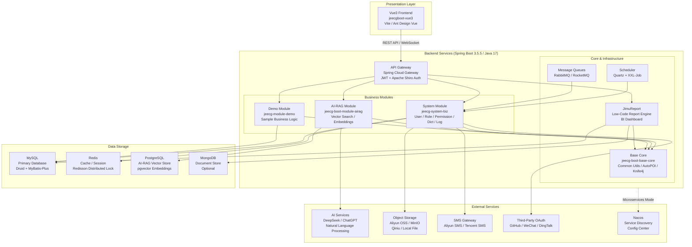

# Architecture Diagram

JeecgBoot is a Java-based low-code development platform built on Spring Boot 3 with a Vue3 frontend, supporting both monolithic and microservices deployment modes.

## Application Architecture

