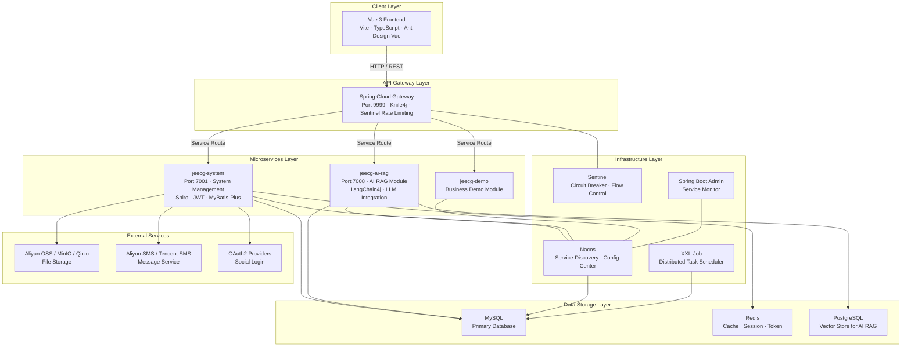

# Architecture Diagram

JeecgBoot is a cloud-native, microservices-based low-code platform built on Spring Boot 3 and Vue 3, supporting both monolithic and distributed deployment modes.

## Application Architecture

