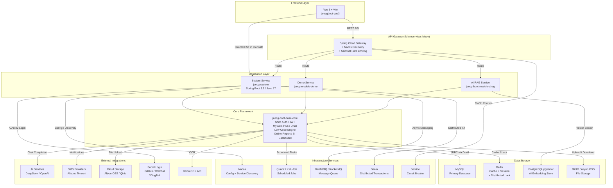

# Architecture Diagram

JeecgBoot is a full-stack low-code development platform built on Spring Boot 3 and Vue 3, supporting both monolithic and microservices deployment modes.

## Application Architecture

