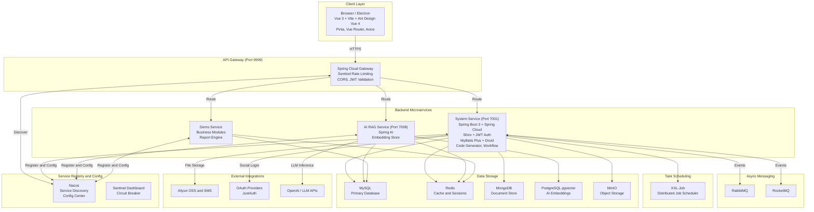

# Architecture Diagram

JeecgBoot is a full-stack, cloud-native low-code platform built on Spring Boot 3 and Vue 3, featuring microservice capabilities, AI/RAG integration, and multi-database support.

## Application Architecture

