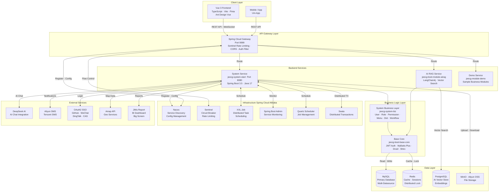

# Architecture Diagram

JeecgBoot is a full-stack enterprise low-code platform built on Spring Boot 3 and Vue 3, supporting both monolithic and microservices deployment modes with AI integration capabilities.

## Application Architecture

