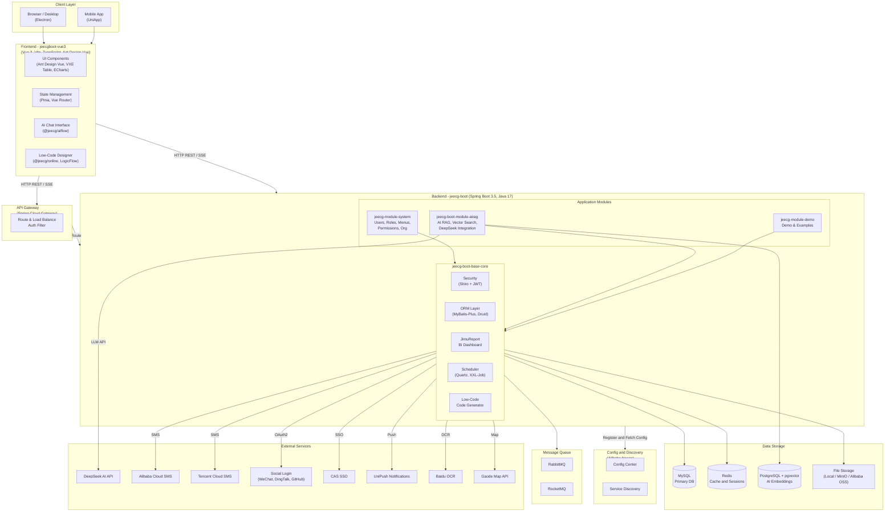

# Architecture Diagram

JeecgBoot is a full-stack enterprise rapid development platform built on Spring Boot 3 (Java 17) for the backend and Vue 3 for the frontend, supporting both monolithic and microservices deployment modes.

## Application Architecture

