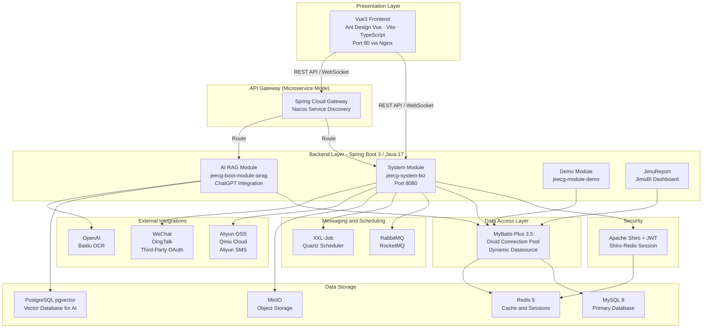

# Architecture Diagram

JeecgBoot is a full-stack low-code development platform with a Vue3 frontend and a Spring Boot 3 backend, supporting both monolithic and microservice deployment modes.

## Application Architecture

