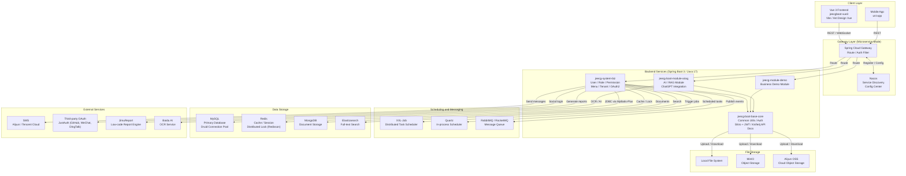

# Architecture Diagram

JeecgBoot is a full-stack low-code platform built on Spring Boot 3 and Vue 3, supporting both monolith and microservice deployment modes.

## Application Architecture

```mermaid
flowchart TB
    subgraph Client["Client Layer"]
        VUE["Vue 3 Frontend\njeecgboot-vue3\nVite / Ant Design Vue"]
        MOBILE["Mobile App\nuni-app"]
    end

    subgraph Gateway["Gateway Layer (Microservice Mode)"]
        GW["Spring Cloud Gateway\nRoute / Auth Filter"]
        NACOS["Nacos\nService Discovery\nConfig Center"]
    end

    subgraph Backend["Backend Services (Spring Boot 3 / Java 17)"]
        SYSTEM["jeecg-system-biz\nUser / Role / Permission\nMenu / Tenant / OAuth2"]
        DEMO["jeecg-module-demo\nBusiness Demo Module"]
        AIRAG["jeecg-boot-module-airag\nAI / RAG Module\nChatGPT Integration"]
        CORE["jeecg-boot-base-core\nCommon Utils / Auth\nShiro + JWT / Knife4j API Docs"]
    end

    subgraph Scheduling["Scheduling and Messaging"]
        XXLJOB["XXL-Job\nDistributed Task Scheduler"]
        QUARTZ["Quartz\nIn-process Scheduler"]
        MQ["RabbitMQ / RocketMQ\nMessage Queue"]
    end

    subgraph Storage["Data Storage"]
        MYSQL["MySQL\nPrimary Database\nDruid Connection Pool"]
        REDIS["Redis\nCache / Session\nDistributed Lock (Redisson)"]
        MONGO["MongoDB\nDocument Storage"]
        ES["Elasticsearch\nFull-text Search"]
    end

    subgraph FileStorage["File Storage"]
        LOCAL["Local File System"]
        MINIO["MinIO\nObject Storage"]
        ALIOSS["Aliyun OSS\nCloud Object Storage"]
    end

    subgraph ExternalSvcs["External Services"]
        SMS["SMS\nAliyun / Tencent Cloud"]
        OAUTH["Third-party OAuth\nJustAuth (GitHub, WeChat, DingTalk)"]
        REPORT["JimuReport\nLow-code Report Engine"]
        BAIDU["Baidu AI\nOCR Service"]
    end

    VUE -->|REST / WebSocket| GW
    MOBILE -->|REST| GW
    GW -->|Route| SYSTEM
    GW -->|Route| DEMO
    GW -->|Route| AIRAG
    GW <-->|Register / Config| NACOS

    SYSTEM --> CORE
    DEMO --> CORE
    AIRAG --> CORE

    SYSTEM -->|JDBC via MyBatis-Plus| MYSQL
    SYSTEM -->|Cache / Lock| REDIS
    SYSTEM -->|Documents| MONGO
    SYSTEM -->|Search| ES

    SYSTEM -->|Trigger jobs| XXLJOB
    SYSTEM -->|Scheduled tasks| QUARTZ
    SYSTEM -->|Publish events| MQ

    CORE -->|Upload / Download| LOCAL
    CORE -->|Upload / Download| MINIO
    CORE -->|Upload / Download| ALIOSS

    SYSTEM -->|Send messages| SMS
    SYSTEM -->|Social login| OAUTH
    SYSTEM -->|Generate reports| REPORT
    AIRAG -->|OCR / AI| BAIDU
```
