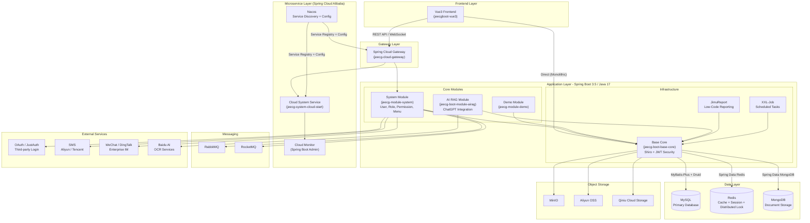

# Architecture Diagram

JeecgBoot is a Spring Boot 3 based low-code platform with a multi-module Maven structure, supporting both monolithic and microservice deployment modes with a Vue3 frontend.

## Application Architecture

